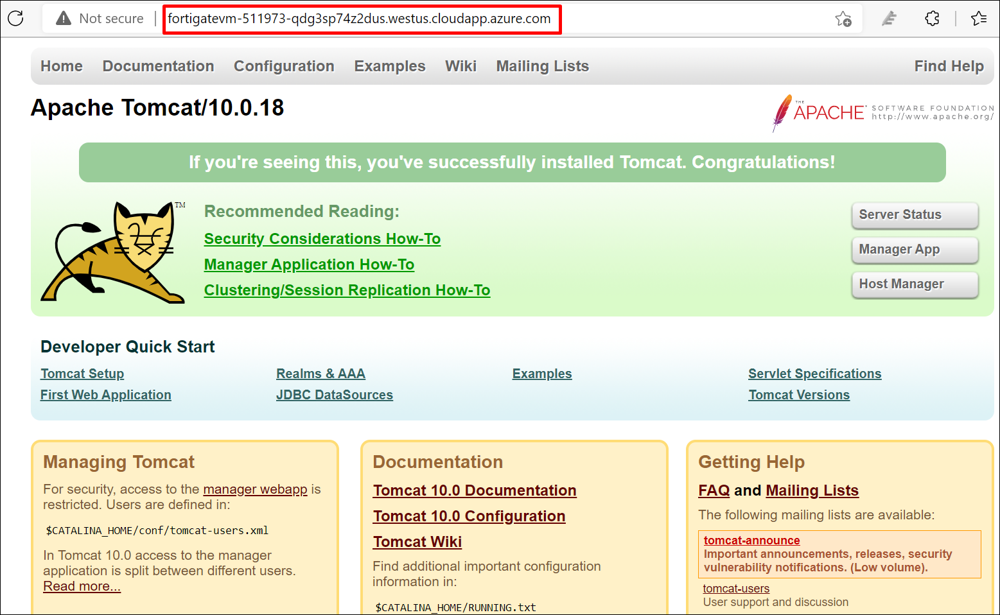

# 05 - Access the Webserver

## Overview 

In this task, you will access the Apache webserver hosted in Azure via the internet using the FQDN which was configured in the previous exercise by providing the Virtual IPs of the webserver.  

## Task: Connect to the Webserver

1. Open a new tab in the browser and copy-paste the following FQDN to access the Apache webserver.

    * <inject key="ApacheFQDN"></inject>
    
2. You should be able to see the Apache webserver in the browser.

       
    
## Summary

In this task, you accessed the Apache webserver through the internet using the Apache-VM's FQDN.

