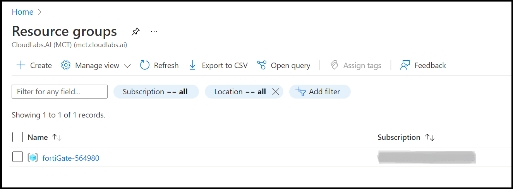

# Getting started with Fortinet on Azure

## Overview: FortiGate Next-Generation Firewall - A Single VM 

As workloads are being moved from local data centers connectivity and security are key elements to take into account. FortiGate-VM offers a consistent security posture and protects connectivity across public and private clouds, while high-speed VPN connections protect data. This single FortiGate-VM setup a basic setup to start exploring the capabilities of the next generation firewall. The central system will receive, using user-defined routing (UDR), all or specific traffic that needs inspection going to/coming from on-prem networks or the public internet. Additionally, Fortinet Fabric Connectors deliver the ability to create dynamic security policies. This environment contains the following components:

  * 1 standalone FortiGate firewall 
  * 1 VNETs containing a protected subnet
  * User Defined Routes (UDR) for the protected subnets

## Architecture Diagram

   
 
 ## Task 1: Getting started with the environment
 
 In this task, you will view the pre-deployed Fortigate Singe-VM, network interfaces and a backend web server.
 
 1. **Launch** the Edge browser and **Navigate** to https://portal.azure.com.

 2. **Login** with your username and password as provided in the **Environment Details** tab.

 3. To toggle **show/hide** the Portal menu options with icon, **Click** on the **Show Menu** button.
 
       
       
 4. **Click** on the **Resource groups** button in the **Menu navigation bar** to view the Resource groups blade.

       
       
 5.  Select the **fortigate-XXXX** resource group in the resource groups blade.

       
 
