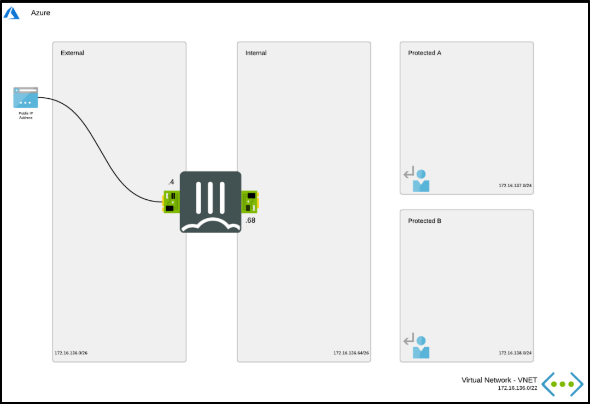

# Getting started with Barracuda CloudGen WAF on Azure

## Overview 

### FortiGate Next-Generation Firewall - A Single VM

As workloads are being moved from local data centers connectivity and security are key elements to take into account. FortiGate-VM offers a consistent security posture and protects connectivity across public and private clouds, while high-speed VPN connections protect data. This single FortiGate-VM setup a basic setup to start exploring the capabilities of the next generation firewall. The central system will receive, using user-defined routing (UDR), all or specific traffic that needs inspection going to/coming from on-prem networks or the public internet. This environment contains the following components:

  * 1 standalone FortiGate firewall 
  * 1 VNETs containing a protected subnet
  * User Defined Routes (UDR) for the protected subnets

### Architecture Diagram

   
