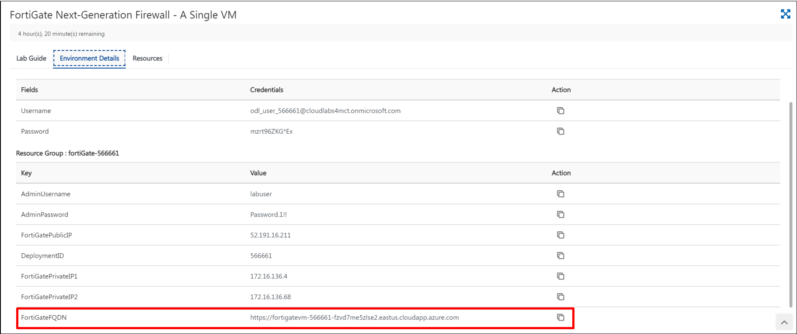

# 01 - Accessing the Fortinet Dashboard 

## Overview 

In this task, you will access the Fortinet dashboard by using the FortiGate FQDN.

## Task 1: Accessing the Fortinet Dashboard 

 1. Open a new tab in the browser and copy-paste the FortiGateFQDN from the environmental details tab.
 
     
     
 2. A page shown below will apear. Click on **Adavanced**.

     
     
 3. Click on the following link on the page as shown below. 

     
     
 4. You will be redirected to the page shown below with empty **Username** and **Password** text boxes. Enter **labuser** as Username and **Password.1!!** as Password.

     
     
 5. A **FortiGate Setup** page appears as shown below. Click on **Begin**

     
     
 6. A **Dashboard Setup** page appears as shown below. Keep the **Optimal** option as default and click on **OK**

     

 7. The **Fortinet** dashboard will appear as shown below.

     
     
 8. Click on **Next** to continue to the next section of the lab.
     

