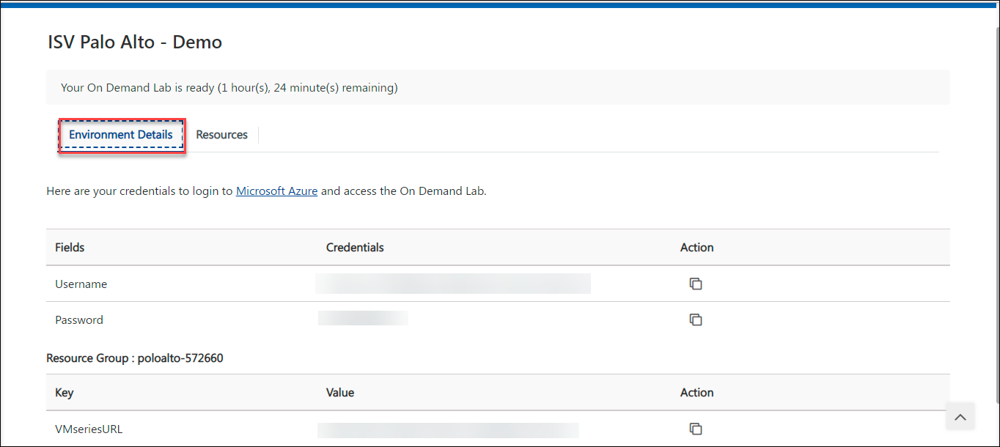
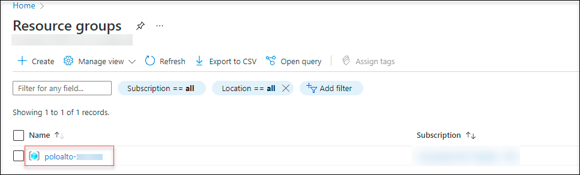

# Getting started with the PaloAlto on Azure

## Overview

 In this task, you will view the pre-created resources of this lab
 
### Task 1 : Getting started with the environment

1. Launch the Edge browser and Navigate to [Azure Portal](https://portal.azure.com)

1. Login with the credentials that are provided under the **Environment Details** tab.

     

1. To toggle **show/hide** the Portal menu options with icon, Click on the **Show Menu** button.

     

1. Click on the **Resource groups** button in the Menu navigation bar, to view the Resource groups blade.

1. On the Resource group blade, select the resource group with **poloalto-DID**.

     

1. You can able to view the deployed resources in that resource group **poloalto-DID**.
