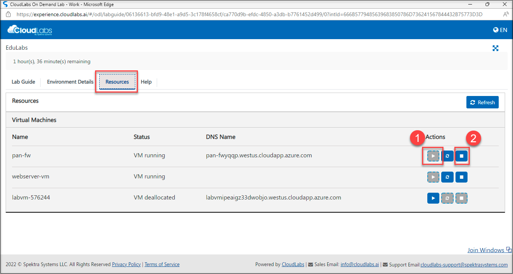

# Getting started 

## Overview

In this task, you will view the pre-created resources of this lab.
 
### Getting started with the environment

1. To get the lab environment details, you can select the Environment Details tab.

1. You can start(1) or stop(2) the Virtual Machine from the Resources tab.
 
     

    
1. To get the lab environment details, you can select the **Environment Details** tab.

1. Click on Next from the bottom right corner and follow the instructions to perform the lab.

      
