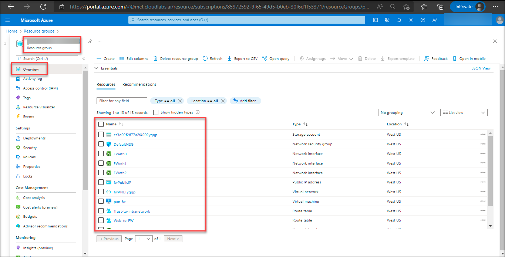
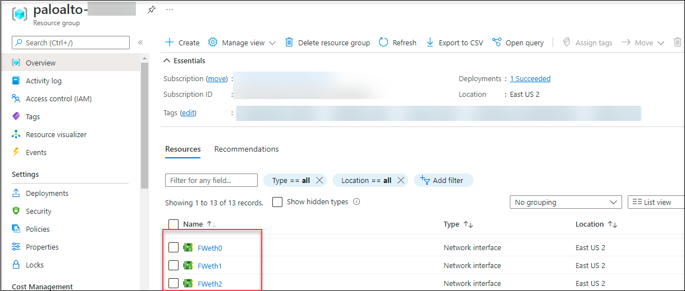
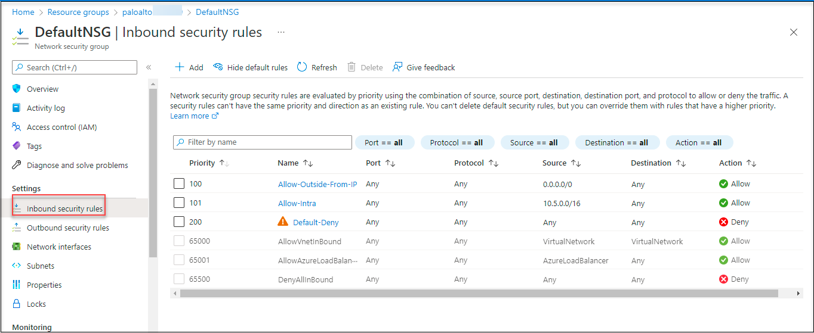
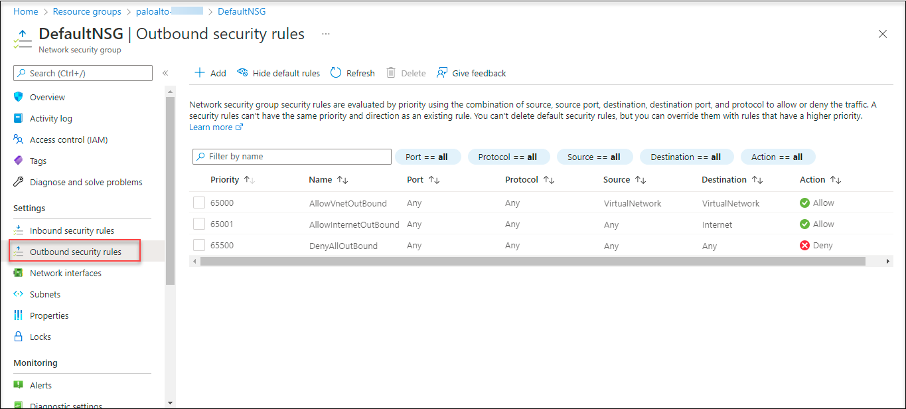
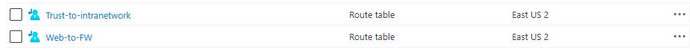

## Task 3: Getting started with the Azure Portal

## Overview

In this task, you will navigate to your resource group and view the pre-deployed resources.

1. On the Azure Portal, click on the **Show Menu** button.

     

1. Click on the **Resource groups** button in the Menu navigation bar, to view the Resource groups blade.

     

1. On the Resource group blade, select the resource group with **paloalto-<inject key="DeploymentID"></inject>**.

1. You can view the deployed resources in that resource group **paloalto-<inject key="DeploymentID"></inject>**.

     
     
1. You can view the **Network Interfaces**. 

     * **FWeth0** - This is the management interface

     * **FWeth1** - This network interface is in the untrust zone

     * **FWeth2** - This network interface is in the trust zone
   
     

     >Note : You can learn more about untrust and trust zone in the next section of the lab

1. You can view the **Network security group** namely **DefaultNSG**.

    * The Network security group specifies the rules that allows and deny access to the resources within the specific resource group.

1. You can view the Inbound and Outbound security rules of the defaultNSG..

    
    
    
    
1. The **User defines Routes(UDR)** enables the VM-series Firewall to secure the resource group

    

# Summary
In this task you navigated to your resource group, and viewed the pre-deployed resourced

Click on **Next** to continue to the next section of the lab.
