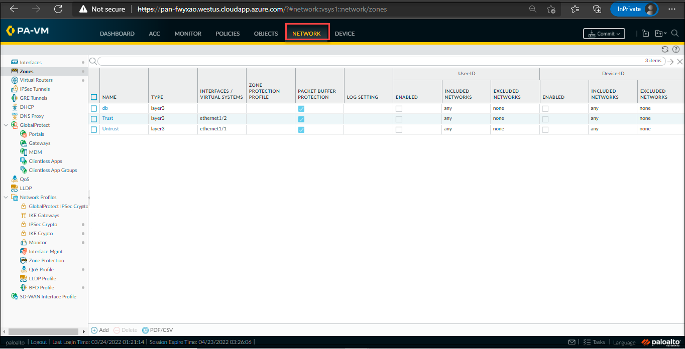
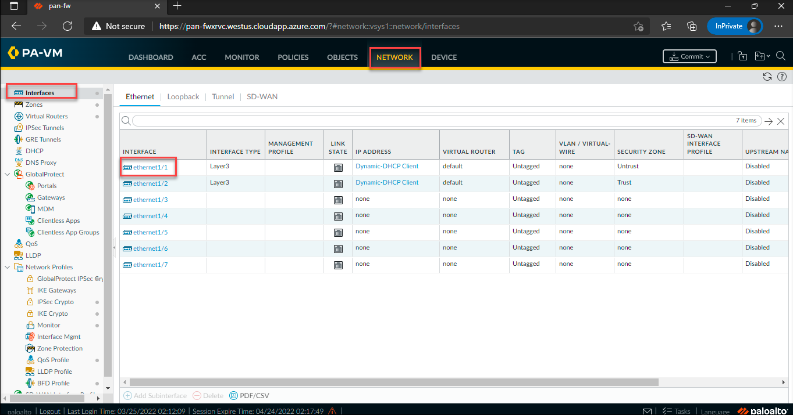
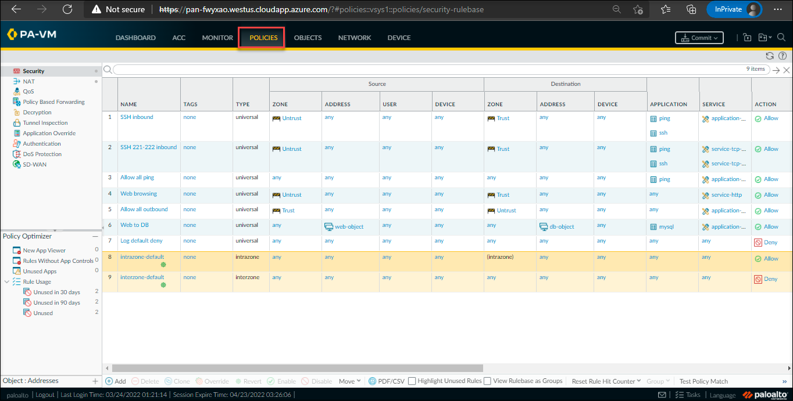

# Task 4: View the Object, Network, and Device Tabs and Security Policies

## Overview

In this task, you will learn about the various management capabilities such as the Object tab, Network tab, Device tab, and security policies.

1. The object tab allows for managing the building blocks for creating policies such as address objects, custom applications, and security profiles.

1. Select the **Object** tab and verify the various options.

    

1. The Network tab allows for to creation and management of interfaces, security zones, VLANs, and other elements that are related to enabling connectivity.

1. Click on the **Network** tab and explore the options.

    

1. The interface(Ethernet 1/1) is called as **Untrust Zone**. This is the interface that is exposed to the outside world. All the traffic enters through this interface.

    

1. The interface(Ethernet 2/2) is called as **Trust Zone**.  This is the interface where assets need to be protected. For example, the web and data servers.

1. The Device tab manages the configuration items such as DNS, and service routes and also allows you to manage high availability, users, software, and content updates.

1. Select the **Device** tab, to view the options.

    
      
1. Now select the **Policies** tab, where you will define all of your policies. The default view will be the security policies for all, which is the application based and the content.

    

1. You can also add the policies such as NAT, Decryption, and Qos to the existing policies.

### Proceed to Task 5: Explore the various options in the Monitor tab
