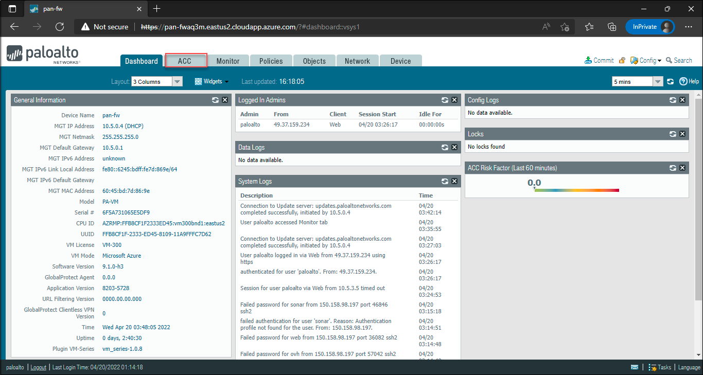
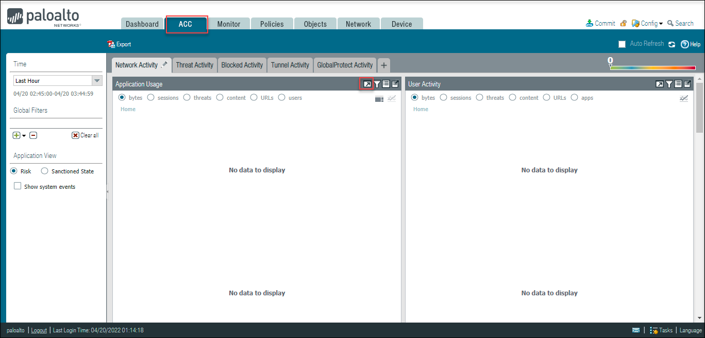
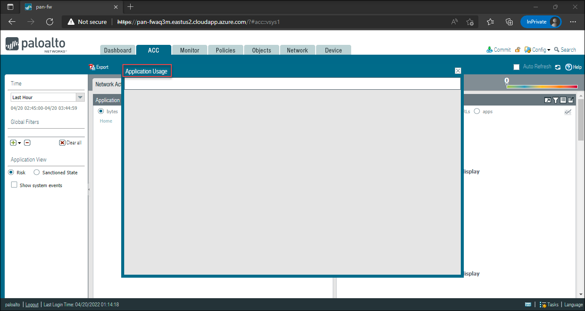

# Task 4: Application Command Center(ACC)

## Overview

In this task, you can view the Application Command Center(ACC). This provides a detailed widget-based summary of the applications, and the default time is 1 hour. With the help of **Application Command Center(ACC)**, you can view the contextual linkage between the application and the content which allows you to make more security decisions.

The default view of **ACC** will show the network, threat, blocked, and tunnel activity in four separate tabs. The time frame and each tab can be customized to display the relevant application, and threat, and can view the user activity depending upon the user role.

1. Switch back to the PaloAlto VMseries Firewall dashboard Page, Click on the **ACC** tab.

    

1. Since this is a new firewall, so you cannot able to view the data.

    

   >Note: You can come back to this page at the end of the lab to see the data.

1. You can explore each of the widgets, by selecting the relevant data point. Clicking on the arrow towards the right of the filter will force all other widgets to be updated based on the context.

    

    

>Note: Since this is a new firewall, you cannot see much data for now.

# Summary
In this task you have explored about Application Command Center(ACC). 

Click on **Next** to continue to the next section of the lab.
