# Getting started with PaloAlto Networks  

## Tasks Included

In this hands-on lab you will perform the following tasks:

- **Task 1: Accessing the PaloAlto Networks Dashboard**
- **Task 2: Login to Azure Portal**
- **Task 3: Getting Started with Azure Portal**
- **Task 4: The Application Command Center(ACC)**
- **Task 5: The Object, Network, and Device Tabs and Security Policies**
- **Task 6: Explore the various options in Monitor tab**
- **Task 7: View the static content on web server**

## Overview

The Palo Alto Networks firewall allows you to specify security policies based on accurate identification of each application seeking access to your network. Unlike traditional firewalls that identify applications only by protocol and port number, the firewall uses packet inspection and a library of application signatures to distinguish between applications that have the same protocol and port, and to identify potentially malicious applications that use non-standard ports

## Architecture Diagram 

   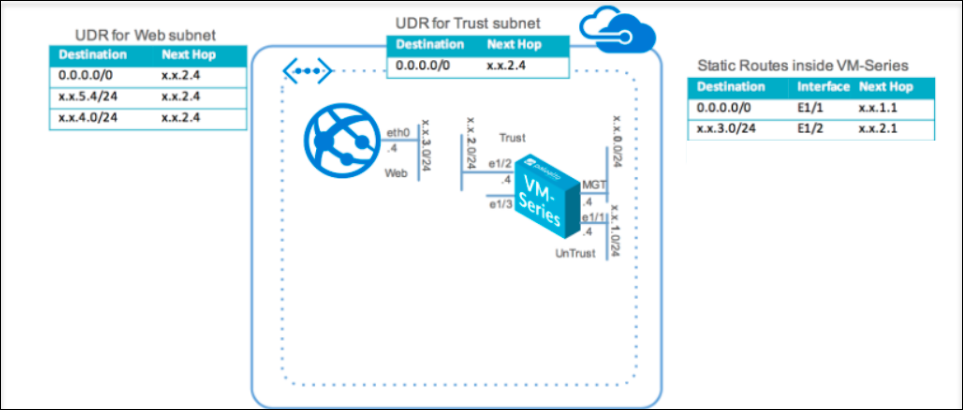
   

# Task 1: Access the PaloAlto Networks Dashboard

## Overview

In this lab, you will be able to access the paloAlto Network Dashboard and explore various options in it.

1. Let us start by logging into the **PaloAlto Networks** page. Copy the link for **PaloAltoVMseriesURL** : <inject key="VMseriesURL"></inject>, open it in a new tab in your browser.

1. If the page is showing like **Your connection isn't private**, on that page click on **Advanced**.
    
    
     
1. Select the link under the **Advanced**.

    
   
1. On the page that loads up, enter the **PaloaltoUsername** : <inject key="PaloaltoUsername"></inject>, **PaloaltoPassword** : <inject key="PaloaltoPassword"></inject>  and click on Log in.

     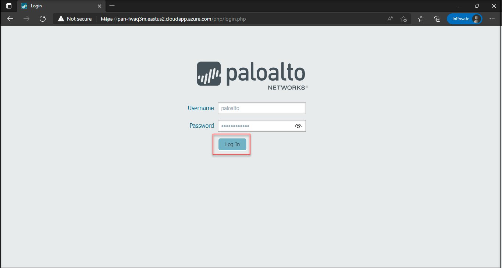

1. Now, you will be redirected to the dashboard to the **PaloAlto Networks**.

1. The dashboard provides a detailed visual summary of the device status.

     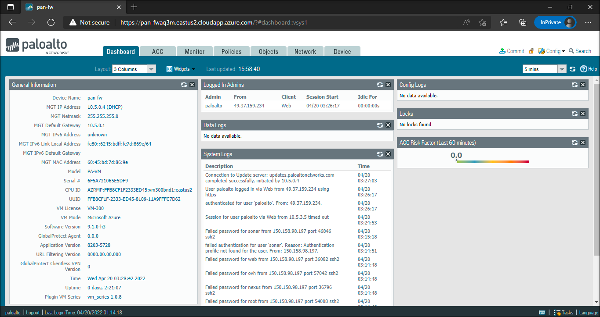
     
> Note: Since it is a new firewall, it doesn't have any traffic yet and can view the dashboard at the end.

# Task 2: Login to Azure Portal

## Overview

In this task you will login to Microsoft Azure using your credentials and access the Azure Portal dashboard.

1. In the LabVM desktop, select the **Azure Portal** icon to access the Azure Portal.

1. On **Sign in to Microsoft Azure** blade, you will see a login screen, in that enter the following email/username and then click on **Next**.

    * **Azure Username/Email**: <inject key="AzureAdUserEmail"></inject> 
    * **Azure Password**: <inject key="AzureAdUserPassword"></inject>
    
    >Note: Refer to the **Environment Details** tab for any other lab credentials/details.
        
   
    
   
   
1. If you see the pop-up like below, click **Skip for now(14 days until this is required)**.

     

1. If you see the pop-up **Stay signed in?** Click **Yes**.

    
    
1. If a **Welcome to Microsoft Azure** popup window appears, click **Maybe Later** to skip the tour.

    
    
1. Now will now see the Azure Portal Dashboard.

## Task 3: Getting started with the Azure Portal

## Overview

In this task, you will navigate to your resource group and view the pre-deployed resources.

1. On the Azure Portal, click on the **Show Menu** button.

     

1. Click on the **Resource groups** button in the Menu navigation bar, to view the Resource groups blade.

     

1. On the Resource group blade, select the resource group with **paloalto-DID**.

1. You can view the deployed resources in that resource group **paloalto-DID**.

     
     
1. You can view the **Network Interfaces**. 

     * **FWeth0** - This is the management interface

     * **FWeth1** - This network interface is in the untrust zone

     * **FWeth2** - This network interface is in the trust zone
   
     

     >Note : You can learn more about untrust and trust zone in the next section of the lab

1. You can view the **Network security group** namely **DefaultNSG**.

    * The Network security group specifies the rules that allows and deny access to the resources within the specific resource group.

1. You can view the Inbound and Outbound security rules of the defaultNSG..

    
    
    
    
1. The **User defines Routes(UDR)** enables the VM-series Firewall to secure the resource group

    
    

# Task 4: Application Command Center(ACC)

## Overview

In this task, you can view the Application Command Center(ACC). This provides a detailed widget-based summary of the applications, and the default time is 1 hour. With the help of **Application Command Center(ACC)**, you can view the contextual linkage between the application and the content which allows you to make more security decisions.

The default view of **ACC** will show the network, threat, blocked, and tunnel activity in four separate tabs. The time frame and each tab can be customized to display the relevant application, and threat, and can view the user activity depending upon the user role.

1. Switch back to the PaloAlto Networks dashboard Page, Click on the **ACC** tab.

    

1. Since this is a new firewall, so you cannot able to view the data.

    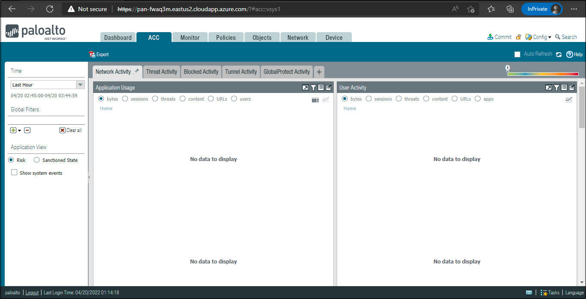

   >Note: You can come back to this page at the end of the lab to see the data.

1. You can explore each of the widgets, by selecting the relevant data point. Clicking on the arrow towards the right of the filter will force all other widgets to be updated based on the context.

    

    

>Note: Since this is a new firewall, you cannot see much data for now.

# Task 5: The Object, Network, and Device Tabs and Security Policies

## Overview

In this task, you will learn about the various management capabilities such as the Object tab, Network tab, Device tab, and security policies.

1. The object tab allows for managing the building blocks for creating policies such as address objects, custom applications, and security profiles.

1. Select the **Object** tab and verify the various options.

    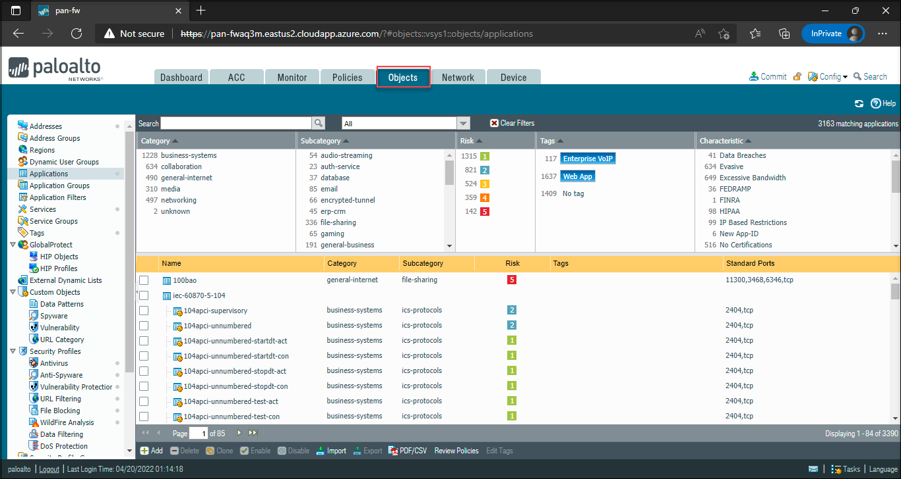

1. The Network tab allows for to creation and management of interfaces, security zones, VLANs, and other elements that are related to enabling connectivity.

1. Click on the **Network** tab and explore the options.

    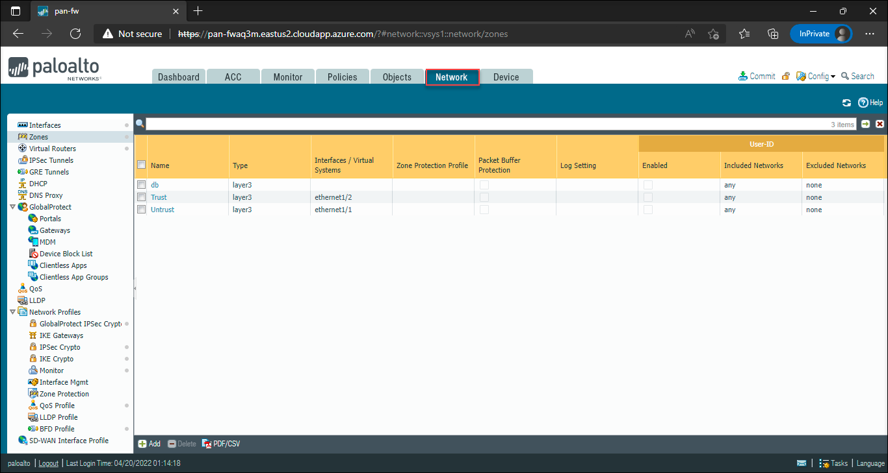

1. The interface(Ethernet 1/1) is called as **Untrust Zone**. This is the interface that is exposed to the outside world. All the traffic enters through this interface.

    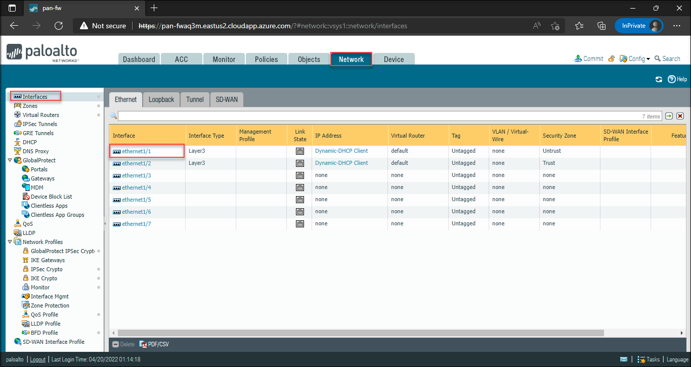

1. The interface(Ethernet 1/2) is called as **Trust Zone**.  This is the interface where assets need to be protected. For example, the web and data servers.

1. The Device tab manages the configuration items such as DNS, and service routes and also allows you to manage high availability, users, software, and content updates.

1. Select the **Device** tab, to view the options.

    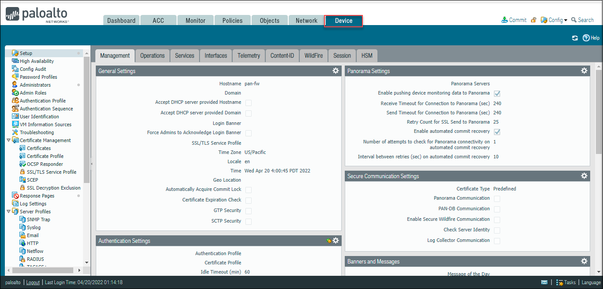
      
1. Now select the **Policies** tab, where you will define all of your policies. The default view will be the security policies for all, which is the application based and the content.

    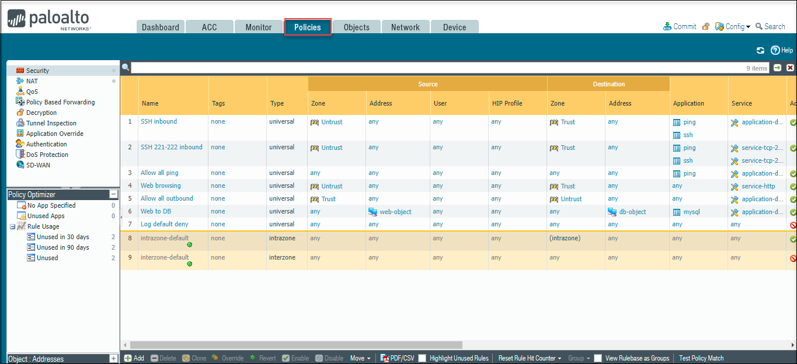

1. You can also add the policies such as NAT, Decryption, and Qos to the existing policies.

# Task 6: Explore the various options in Monitor tab

## Overview

In this lab, you can view the log analysis and generate reports on all traffic flowing through VM-Series and explore various options in **Monitor** tab.

1. On the dashboard, select **Monitor** tab.

    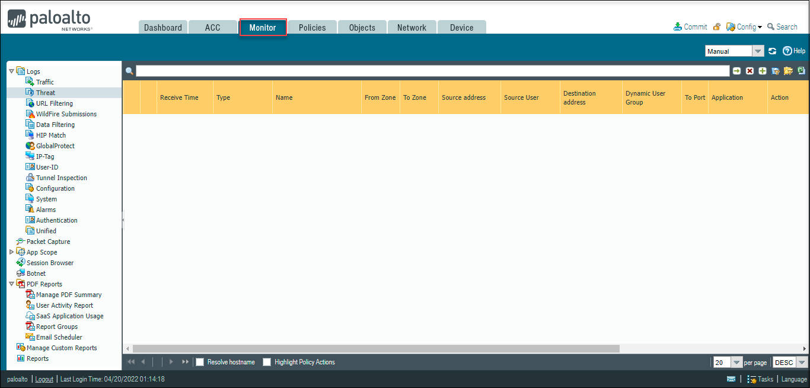
    
>Note : Since the firewall is new, you cannot see any data for now, you can return to this step at the end of the lab and can verify the data.

2. The below screenshot refers to different option to **view and analyze logs** within the **Monitor** tab.

    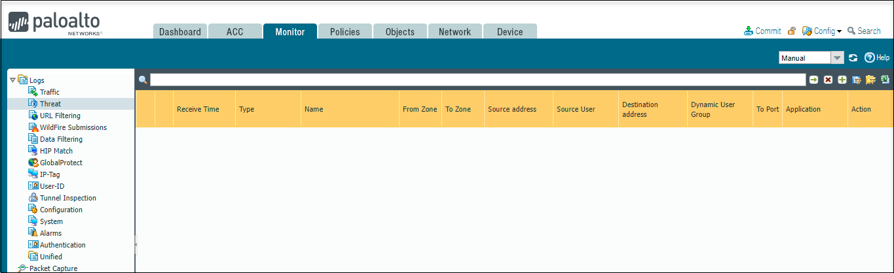
     
3. The screenshot represents the various items  related to **compare the activity over the time period**.

    

4. You can view the various option for **Fully customizable reporting** under the **Monitor** tab.

    
    

# Task 7: Verify the static content on web server

## Overview

In this task, you will see that link state for the interfaces will be **OFF** and the static content of the webserver page will be showing an error at this moment. You will resolve that error and can able to view the static content of the web server and also verify the status of the link state for the interfaces will be **UP**

1. On the **PaloAlto Networks** dashboard page, select the **Network** tab and select **Interfaces** and verify the **Link State** is **OFF** for the interface type **Layer 3**.

    

1. Navigate to the **Environment Details** tab, copy the URL of **WebServer URL** and open it in the browser. You can verify the page showing error that is attached below.

    

1. In the PaloAlto Networks dashboard, on the top right corner, click on **Commit**.

    

1. If a pop-up appears, click on **Commit** and wait till the process completes. On the commit status page, verify the status as **Completed** and result should be **Successful**.

    

    

1. Now on the **PaloAlto Networks** dashboard, navigate to the **Network** tab and select the **Interfaces** and verify the **Link Status** is **UP**. The Interfaces should turn into the **Green** color.

    

1. To verify the static content of the webserver. Navigate to the **Environment Details** tab and copy the URL of **WebServerURL**: <inject key="WebServerURL"></inject> and open it in the new browser.

   

1. To verify the traffic, click on the **Monitor** tab and then select **Traffic**. You can view the related **Traffic**

   

1. Navigate to the **Dashbord** and you can see the data for **Config Logs** and **System Logs**.

    

1. On the **PaloAlto Networks** dashboard Page, Click on the ACC tab to view the data.

    

1. By clicking on the arrow towards the right of the filter, which will force all other widgets to be updated based on the context.

    
    
# Summary
In this task you have verified the static content of the web server and the status of the link state for the interfaces will be UP

# Congratulations, you have successfully completed the lab
