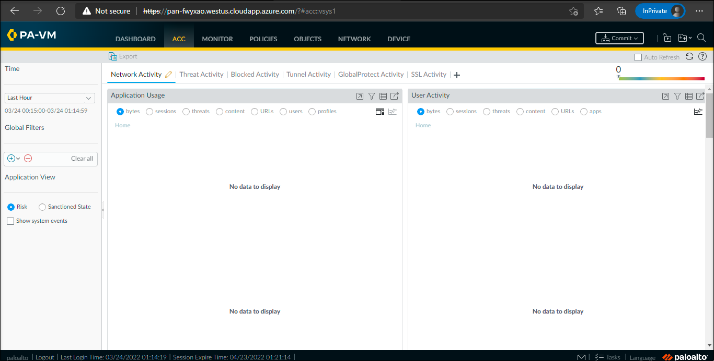

## 02 : To view the Application Command Center(ACC)

### Overview

In this task, you can able to view the Application Command Center(ACC). This provides the detailed widget-based summary of the applications, and the default time period is 1 hour. With the help of **Application Command Center(ACC)**, you can able to see the contextual linkage between the application and the content. 

## Task 2 : To view the Application Command Center(ACC)

1. Swtich back to the Firewall dashboard Page, Click on the **ACC** tab.
 
    

1. You cannot able to see the data because this is a new firewall. 

    
    
  >Note : You can come back to this page at the end of the lab to see the data.  

