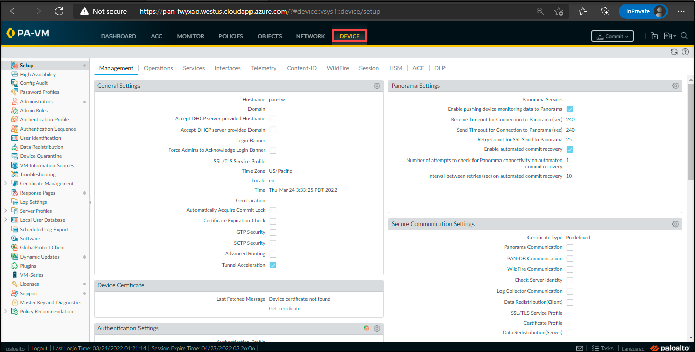
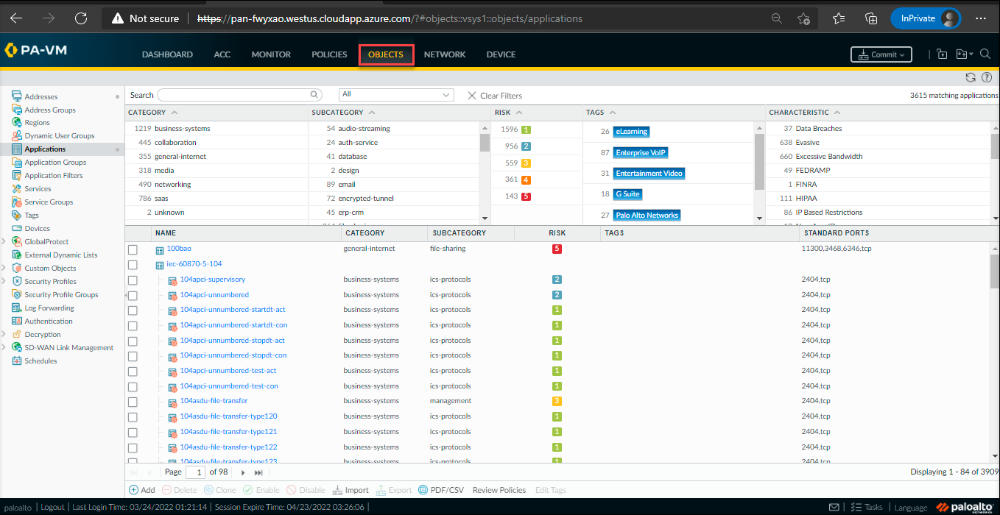

## 03 : To view the Object, Network and Device Tabs

### Overview

In this task, you will learn about the various management capabilities such as Object tab, Network tab and Device tab.
  
## Task 3 : To To view the Object, Network and Device Tabs and Security Policies

1. The Object tab allows to manage the building blocks for creating policies such as address objects, custom application and security profiles.
    
1. The Network tab allows to create and manage interfaces, security zones, VLANs and other elements that are related to enable connectivity.

     

1. The Device tab manages the configuration items such as DNS, service routes and also allows you to manage high availability, users, software and content updates.

      
