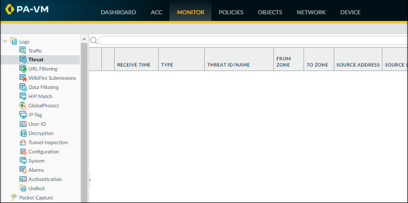
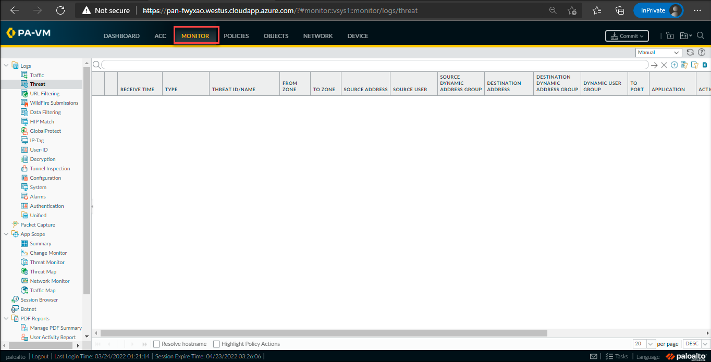
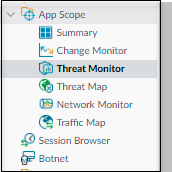
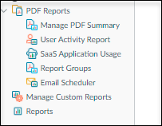

# Task 4 : To explore the various options in Monitor tab

## Overview

In this lab, you can perform log analysis and generate reports on all traffic flowing through VM-Series and explore various options in **Monitor** tab.

1. On the dashboard, select **Monitor** tab.

    
    
    >Note : If your firewall is new, you cannot see any data for now, you can return to this step at the end of the lab and can verify the data.

1. The below screenshot refers to different option to **view and analyze logs** within the **Monitor** tab.

    
     
1. The screenshot represents the various items  related to **compare the activity over the time period**.

    
     
1. You can view the various option for **Fully customizable reporting** under the **Monitor** tab.

    
    
# Procees to Task 5 : To view the static content on web server

