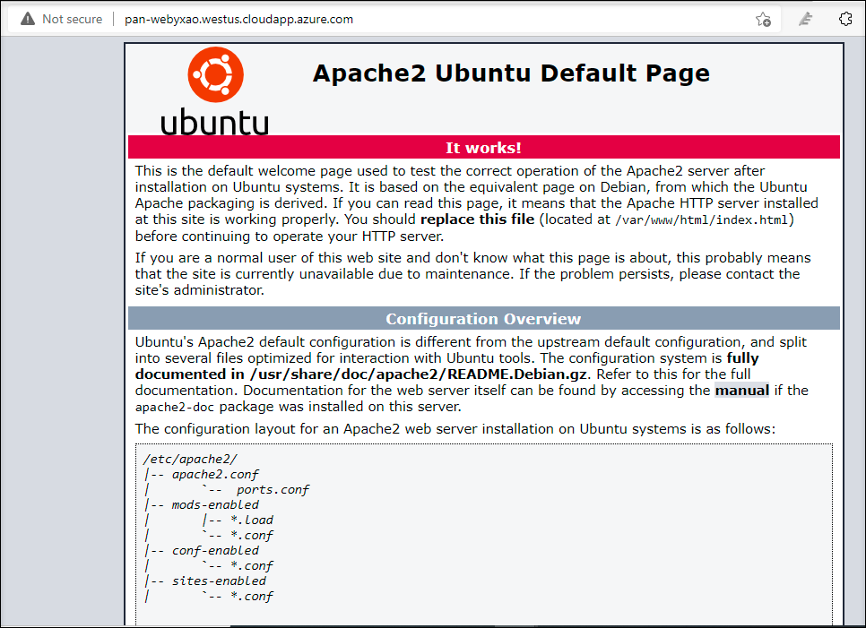
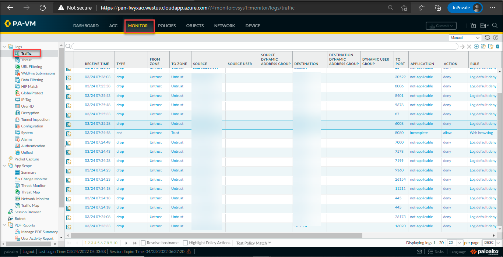

### Task 5 : To view the static content on web server

## Overview

In this task, you will be able to view the static content on web server

1. In the Firewall dashboard, on the top right corner, click on **Commit** and wait till the process completes.

    
    
1. To verify the static content of the webserver. Copy the below link and open it in the new browser.

   <inject key="WebServerURL" enableCopy="true" />
   
   
   
1. To verify the traffic, click on the **Monitor** tab and then select **Traffic**. You can view the related **Traffic**

   

