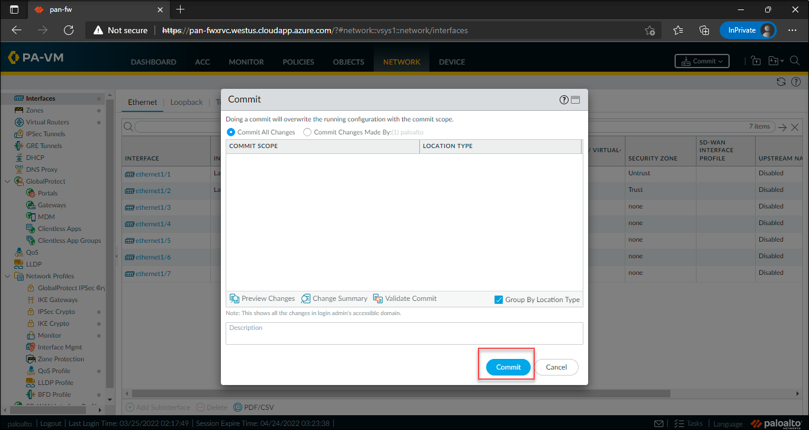
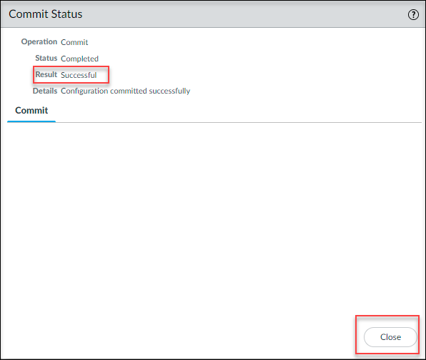
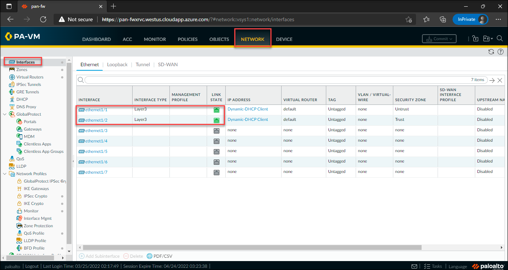
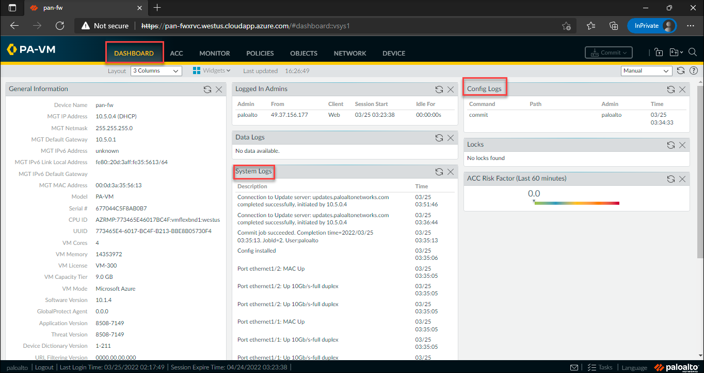

## Task 5 : To view the static content on web server

## Overview

In this task, you will see that link state for the interfaces will be **OFF** and the static content of the webserver page will be showing error at this moment. You will resolve that error and can able to view the static content of the web server and also verify the status of the link state for the interfaces will be **UP**

1. On the **PaloAlto Network** dshboard page, select the **Network** tab and select **Interfaces** and verify the **Link State** of the Interface type **Layer 3**. You can observe that the link state is **OFF**.

1. Navigate to the **Environment Details** tab, copy the URL of **WebServer URL** and open it in the browser. You can verify the page showing error that is attached below.
    
    
  
1. In the Firewall dashboard, on the top right corner, click on **Commit**.

    

1. If a pop-up appears, click on **Commit** and wait till the process completes. On the commit status page, verify the status as **Completed** and result should be **Successful**. 

    
    
    
    
1. To verify the static content of the webserver. Navigate to the **Environment Details** tab and copy the URL of **WebServerURL** and open it in the new browser.
   
   
   
1. Now switch back to the **Palolalto Network** dashboard, navigate to the **Network** tab and select the **Interfaces** and verify the **Link Status** is **UP**. The Interfaces should turn into the **Green** color.

    

1. To verify the traffic, click on the **Monitor** tab and then select **Traffic**. You can view the related **Traffic**

   
   
1. Navigate to the **Dashbord** and you can see the data for **Config Logs** and **System Logs**.
 
    

   

